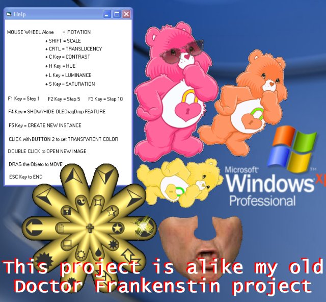



## Realtime Image Manipulation

### Description

This is an improve to the excellent CodeId=67981 by Lefteris Eleftheriades . Now with Mouse Wheel Support, Multi-Instances, Transparent ambient, Tranlucency and more. I made an alike project long time ago (Doctor Frankenstin - CodeId=63677 ) with all this features, but this is more compact. If you vote for me, please vote to Lefteris too. Requires Windows XP.
 
### More Info
 

             |
---                |---
**Submitted On**   |2007-04-24 20:17:42
**By**             |[Agustin Rodriguez](https://github.com/Planet-Source-Code/PSCIndex/blob/master/ByAuthor/agustin-rodriguez.md)
**Level**          |Intermediate
**User Rating**    |5.0 (10 globes from 2 users)
**Compatibility**  |VB 6\.0
**Category**       |[Graphics](https://github.com/Planet-Source-Code/PSCIndex/blob/master/ByCategory/graphics__1-46.md)
**World**          |[Visual Basic](https://github.com/Planet-Source-Code/PSCIndex/blob/master/ByWorld/visual-basic.md)
**Archive File**   |[Realtime\_I2062144242007\.zip](https://github.com/Planet-Source-Code/agustin-rodriguez-realtime-image-manipulation__1-68440/archive/master.zip)

